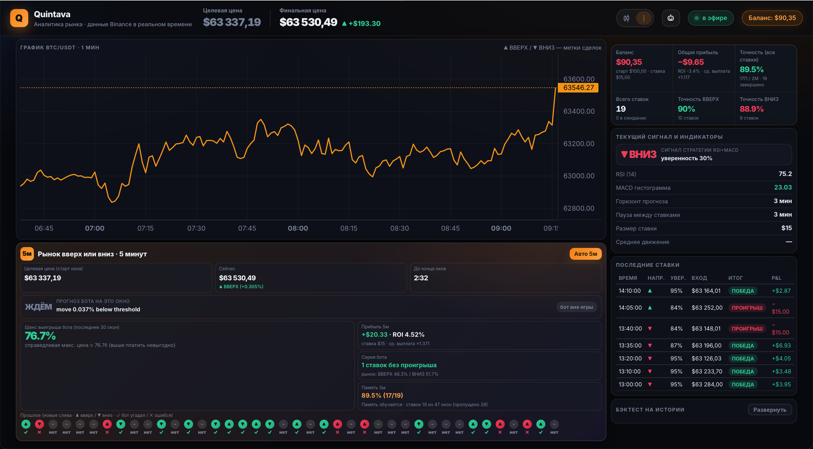
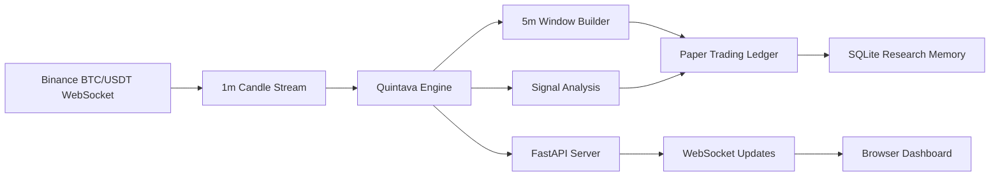

# Quintava

[](https://www.python.org/)
[](https://fastapi.tiangolo.com/)
[](https://www.binance.com/)
[](LICENSE)

**Real-time BTC prediction market dashboard with AI signal analysis**

Quintava is an open source research tool for studying short-horizon BTC prediction markets without risking real funds. It streams live BTC/USDT data, reconstructs Polymarket-style 5-minute UP/DOWN windows, generates paper-trading signals, estimates odds-based payouts, and tracks live performance in a browser dashboard.

> Disclaimer: Quintava is for education, research, and paper trading only. It is not financial advice, investment advice, or a guarantee of profit.

## Screenshot

Add a dashboard screenshot at:

```text
docs/screenshot.png
```

Then update this section with:

```markdown

```

You can capture the running dashboard from `http://localhost:8000`.

## What It Solves

- Paper trading Polymarket-style markets without financial risk.
- Testing short-horizon BTC strategies on live Binance market data.
- Providing a free research tool for traders, builders, and market analysts.
- Creating an open source foundation for the fintech and prediction-market community.

## Features

- 📈 **Live BTC/USDT streaming** from Binance 1-minute candles.
- 🎯 **Polymarket-style 5-minute UP/DOWN windows** with target price, countdown, current leader, and outcome tracking.
- 🧪 **Paper trading engine** with virtual stake sizing, live settlement, win rate, ROI, and balance tracking.
- 💸 **Odds-based payout model** that estimates entry price, payout multiplier, realized P&L, and live mark-to-market position value.
- 🧠 **Signal memory** that records completed windows and tracks live strategy quality over time.
- 🔍 **Backtesting utilities** for historical accuracy checks and parameter search.
- ⚡ **Auto-tuning workflow** for evaluating candidate strategy parameters with walk-forward validation.
- 🖥️ **FastAPI dashboard** with WebSocket updates, charting, recent bets, strategy stats, and live status.
- 🔐 **Paper-first architecture** so researchers can validate assumptions before considering real trading integrations.

## Installation

Clone the repository:

```bash
git clone https://github.com/Django-Wu/quintava.git
cd quintava
```

Create and activate a virtual environment:

```bash
python3 -m venv venv
source venv/bin/activate
```

Install dependencies:

```bash
pip install -r requirements.txt
```

Optional environment configuration:

```bash
cp .env.example .env
```

If you do not plan to use live trading integrations, you can run Quintava without Polymarket API credentials.

## Quick Start

Start the dashboard:

```bash
python server.py
```

Open:

```text
http://localhost:8000
```

The application runs in paper-trading mode by default. It does not place real orders.

Default research settings:

```text
STAKE=5
STARTING_BALANCE=100
M5_STRATEGY=follow_lead
M5_ENTRY_MIN=1
M5_MIN_MOVE_PCT=0.05
M5_MIN_VOLATILITY_PCT=0.02
```

Run a historical backtest:

```bash
python backtest.py --hours 83 --confidence 30 --horizons 1,3,5,15 --cooldown 3
```

Run 5-minute strategy optimization:

```bash
python optimize_5m.py --hours 83 --min-signals 30
```

## Architecture



Core components:

- `server.py` - FastAPI application, HTTP API, WebSocket server, and dashboard entry point.
- `engine.py` - live orchestration layer for Binance data, 5-minute market windows, signals, and paper trading.
- `bot_core.py` - indicators, Binance client, odds model, SQLite paper trader, and reusable strategy logic.
- `static/index.html` - live dashboard UI.
- `backtest.py` - historical strategy validation.
- `optimize.py` and `optimize_5m.py` - parameter search utilities.
- `polymarket_bot.py` - experimental Polymarket integration for future live-trading workflows.

## How It Uses AI

Quintava is designed as an AI-ready research platform. The current open source version focuses on deterministic signal analysis, transparent paper trading, and reproducible strategy evaluation. The AI roadmap is intended to support OpenAI-powered research workflows while keeping the trading layer auditable.

Planned AI extensions:

- **Future: GPT-4 for strategy generation** - use GPT models to propose new trading hypotheses, explain signal behavior, summarize backtest results, and generate strategy variants for human review.
- **Future: Vision for chart analysis** - use multimodal models to inspect chart screenshots, identify visible price-action structures, and compare visual setups against quantitative signals.
- **Future: Embeddings for historical pattern search** - embed completed market windows and retrieve similar historical conditions to estimate how comparable setups performed in the past.

AI features should be treated as research assistants, not autonomous financial decision makers. All generated strategies should be backtested, validated out-of-sample, and reviewed before any live deployment.

## Open Source Grant Fit

Quintava aligns with open source research goals by making short-horizon market experimentation accessible, transparent, and reproducible:

- It provides a free tool for learning how prediction-market odds, win rate, payout, and ROI interact.
- It encourages paper trading and risk-free validation before real capital is considered.
- It creates a shared codebase for fintech builders to experiment with live data, strategy design, and AI-assisted analysis.
- It can serve as a sandbox for evaluating how language models, vision models, and embeddings can support financial research responsibly.

## Contributing

Contributions are welcome. Good first areas include:

- New technical indicators and signal modules.
- Better odds estimation and market microstructure modeling.
- More robust backtesting and walk-forward validation.
- Strategy notebooks and reproducible research reports.
- Dashboard improvements and accessibility.
- AI-assisted research workflows using OpenAI APIs.

Before opening a pull request:

1. Keep changes focused and explain the research motivation.
2. Avoid committing secrets, `.env`, local databases, or personal trading history.
3. Include tests or backtest output when changing strategy logic.
4. Clearly label experimental features.

## Safety and Ethics

Quintava is intentionally paper-first. Prediction markets involve spread, liquidity, fees, volatility, oracle/resolution risk, and behavioral risk. A high historical win rate does not imply future profitability.

Do not use this project as a substitute for professional financial advice. If real trading support is added, it should remain opt-in, clearly documented, and protected by strict risk controls.

## License

MIT License. See [`LICENSE`](LICENSE).
