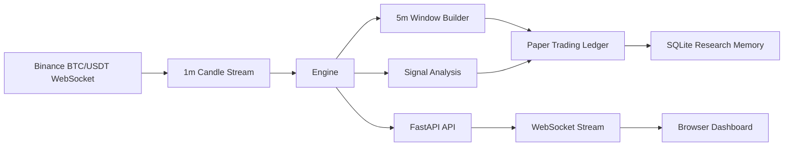

# Quintava Architecture

Quintava is organized as a paper-first research system for short-horizon BTC prediction markets.

## Data Flow

## Components

- `server.py` starts the FastAPI application, exposes HTTP endpoints, and streams live updates over WebSocket.
- `engine.py` coordinates Binance data, 5-minute market windows, signal generation, and paper-trading state.
- `bot_core.py` contains reusable market primitives: Binance client, indicators, odds model, paper trader, and SQLite persistence.
- `static/index.html` renders the live dashboard.
- `backtest.py`, `optimize.py`, and `optimize_5m.py` provide offline research workflows.

## Persistence

Quintava stores paper-trading history in SQLite:

- `predictions` keeps legacy directional paper signals.
- `m5_windows` stores completed 5-minute windows, bot predictions, confidence, correctness, odds estimates, and payout multipliers.

Local databases are ignored by Git and should not be published with personal research history.
